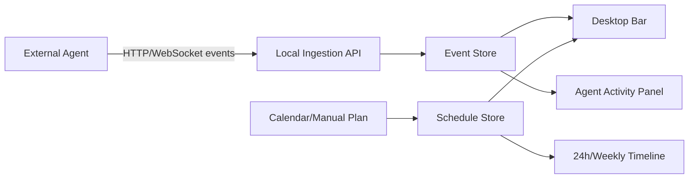

# Architecture Sketch

## Product Surface

- Desktop bar: 常驻屏幕边缘，展示当前时间、今日进度、下一项安排、正在运行的 agent。
- Timeline panel: 展开后查看 24 小时和 weekly timeline。
- Agent panel: 查看 agent 列表、当前任务、调用链、工具调用、日志、产物。
- Integration settings: 管理 agent token、接入端点、权限和通知规则。

## Candidate Stack

### Preferred for MVP

- Desktop: Tauri 2
- UI: React + TypeScript + Vite
- Styling: Tailwind CSS or CSS modules
- Charts/timeline: custom SVG/Canvas timeline, with possible D3 scale utilities
- Local state: Zustand or TanStack Store
- Local persistence: SQLite through Tauri SQL plugin, or embedded Rust-side SQLite
- Event transport: local WebSocket for live events, HTTP endpoint for batch ingestion

Reasoning:

- Tauri is lightweight and suitable for a desktop overlay/bar.
- React/TypeScript keeps the UI iteration speed high.
- Rust side can own native desktop concerns: window positioning, tray, global shortcuts, local storage, process lifecycle.

### Alternative

- Electron + React if overlay/window edge cases become easier than Tauri on Windows.
- Wails + React if Go backend integration becomes more attractive.

## Event Model Draft

```ts
type AgentEvent = {
  id: string;
  agentId: string;
  runId: string;
  type:
    | "run.started"
    | "run.status"
    | "tool.called"
    | "tool.result"
    | "artifact.created"
    | "plan.updated"
    | "error"
    | "run.finished";
  timestamp: string;
  title: string;
  summary?: string;
  status?: "queued" | "running" | "blocked" | "done" | "failed";
  payload?: unknown;
};

type ScheduleBlock = {
  id: string;
  title: string;
  start: string;
  end: string;
  source: "manual" | "calendar" | "agent";
  status?: "planned" | "active" | "done" | "skipped";
  relatedAgentRunId?: string;
};
```

## Local Data Flow



## MVP Milestones

1. Create a static desktop bar mock with sample schedule and sample agent events.
2. Add local event schema and mocked ingestion stream.
3. Add real local WebSocket/HTTP ingestion.
4. Persist schedule blocks and agent events locally.
5. Add first real connector, likely Codex/Claude Code/OpenHands style event adapter.
