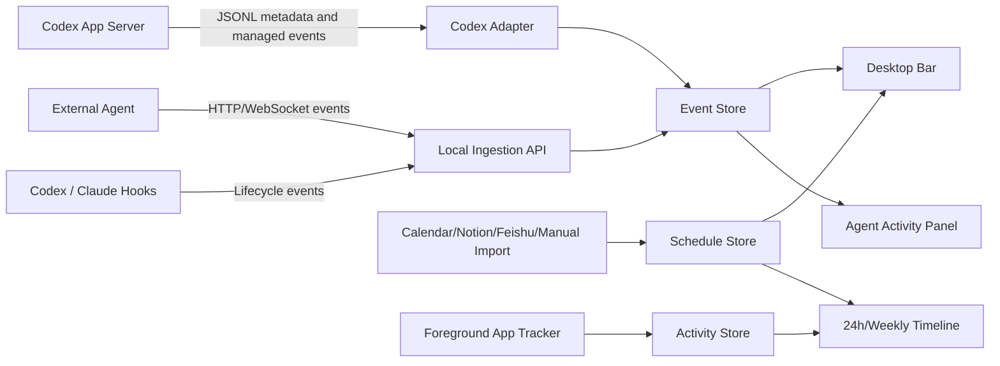

# Architecture Sketch

## Product Surface

- Desktop bar: 常驻屏幕边缘，展示当前时间、今日进度、下一项安排、正在运行的 agent。
- Timeline panel: 展开后查看 24 小时和 weekly timeline。
- Agent panel: 查看 agent 列表、当前任务、调用链、工具调用、日志、产物。
- Integration settings: 管理 agent token、接入端点、权限和通知规则。
- Morning planner: 汇总多来源事项，生成可确认的当天安排草案。
- Daily review: 对照计划与实际时间，处理未完成事项。

## Selected Stack

### MVP Baseline

- Desktop: Tauri 2
- UI: React + TypeScript + Vite
- Styling: Tailwind CSS or CSS modules
- Timeline and business UI: React DOM + SVG, with possible D3 scale utilities
- Pixel office: Canvas 2D, with PixiJS as the complexity-driven upgrade path
- Local state: Zustand or TanStack Store
- Local persistence: SQLite through Tauri SQL plugin, or embedded Rust-side SQLite
- Codex transport: App Server JSONL over stdio for metadata and managed runs; Hooks for passive lifecycle events
- Generic event transport: adapter-owned local IPC normalized into `AgentEvent`

Reasoning:

- Tauri is lightweight and suitable for a desktop overlay/bar.
- React/TypeScript keeps the UI iteration speed high.
- DOM/SVG keeps timeline text, layout, interaction and accessibility straightforward.
- Canvas isolates high-frequency pixel animation from the rest of the application UI.
- SQLite fits a local-first, single-user product that needs reliable time-range queries and aggregation.
- Rust side can own native desktop concerns: window positioning, tray, global shortcuts, local storage, process lifecycle.

### Decision Gates And Alternatives

- Switch from Tauri to Electron if the Windows spike cannot reliably support always-on-top, transparent/borderless windows, multi-monitor DPI, focus behavior, click-through, sleep/wake recovery and foreground-window tracking without excessive native work.
- Upgrade Canvas 2D to PixiJS when the office needs many simultaneous sprites, camera effects, particles, complex asset packs or a scene editor.
- Keep PostgreSQL or another cloud database out of the MVP; reconsider it when account-based multi-device or team synchronization becomes a primary requirement.
- Wails + React if Go backend integration becomes more attractive.

## Event Model Draft

```ts
type AgentEvent = {
  id: string;
  agentId: string;
  runId: string;
  type:
    | "run.started"
    | "run.status"
    | "tool.called"
    | "tool.result"
    | "artifact.created"
    | "plan.updated"
    | "error"
    | "run.finished";
  timestamp: string;
  title: string;
  summary?: string;
  status?: "queued" | "running" | "blocked" | "done" | "failed";
  payload?: unknown;
};

type ScheduleBlock = {
  id: string;
  title: string;
  start: string;
  end: string;
  source: "manual" | "calendar" | `calendar:${string}` | "agent";
  status?: "planned" | "active" | "done" | "skipped";
  relatedAgentRunId?: string;
};

type ActivityRecord = {
  id: string;
  start: string;
  end: string;
  appName: string;
  sanitizedWindowTitle?: string;
  category?: string;
  source: "foreground-window" | "manual";
};

type IntegrationCapability = {
  sourceId: string;
  read: boolean;
  write: boolean;
  subscribe: boolean;
  controls?: Array<
    "pause" | "resume" | "terminate" | "approve" | "reprioritize" | "handoff"
  >;
};
```

## Local Data Flow


```mermaid
flowchart LR
  Agent["External Agent"] -->|HTTP/WebSocket events| Ingest["Local Ingestion API"]
  Codex["Codex App Server"] -->|JSONL metadata and managed events| CodexAdapter["Codex Adapter"]
  Hooks["Codex / Claude Hooks"] -->|Lifecycle events| Ingest
  Calendar["Calendar/Notion/Feishu/Manual Import"] --> Schedule["Schedule Store"]
  Tracker["Foreground App Tracker"] --> Activity["Activity Store"]
  CodexAdapter --> EventStore
  Ingest --> EventStore["Event Store"]
  EventStore --> Bar["Desktop Bar"]
  Schedule --> Bar
  Activity --> Timeline["24h/Weekly Timeline"]
  EventStore --> AgentPanel["Agent Activity Panel"]
  Schedule --> Timeline["24h/Weekly Timeline"]
```

## Integration Boundary

- Notion: 使用正式 API 读取任务数据源并在授权后写回状态。
- Feishu: 使用日历 API；消息事件需要企业自建应用、明确权限和事件订阅。
- System calendar: 第一版先用 ICS 建立通用只读导入和冲突预览，再接 Microsoft Graph/Outlook、Google Calendar 和飞书授权同步。
- Personal WeChat: 第一版只接受用户主动提供的文本、截图或导出文件，不读取本地聊天数据库。
- Agent adapters: 每个适配器声明观察和控制能力，界面只展示真实可用操作。

## Codex Integration Layers

Codex 接入不能只依赖一个 Skill，需要分层实现：

1. **Hooks：被动观察**
   - 接收 SessionStart、UserPromptSubmit、PreToolUse、PostToolUse、PermissionRequest、SubagentStart、SubagentStop 和 Stop 等生命周期事件。
   - 将事件标准化为 AgentEvent，驱动时间轴和像素角色状态。
   - Hooks 适合观察和策略拦截，不作为完整任务控制协议。
2. **Codex SDK / App Server：托管与控制**
   - Agent Bar 创建并管理 Codex thread/turn 时，使用 SDK 或 App Server 获取结构化事件。
   - 通过 App Server 处理中断和批准请求，提供可靠的终止与审批能力。
   - 只有 Agent Bar 托管的运行才能保证完整控制；外部已有 Codex 会话可能只能观察。
3. **Agent Bar MCP Server：让 Codex 使用时间能力**
   - 向 Codex 暴露读取日程、提交事项、查询空闲时间、请求重新排程和上报产物等工具。
   - MCP 是实时工具和外部数据边界，不负责规定完整工作流程。
4. **Agent Bar Skill：定义可重复工作流**
   - 描述早晨规划、任务登记、晚间复盘等工作流，以及何时调用 Agent Bar MCP 工具。
   - Skill 是说明、脚本和参考资料的集合，不是常驻事件服务。
5. **Agent Bar Plugin：后期分发**
   - 产品稳定后，将 Skill、MCP 配置和可信 Hooks 打包为可安装插件。
   - 桌面应用和本地数据服务仍是独立核心，不嵌入 Skill 文件夹。

### Implemented Codex boundary

- 当前原生适配器通过 `codex app-server` 的 `initialize` 和只读 `thread/list` 获取任务元数据。
- App Server 进程由 Agent Bar 短时启动、查询后终止，不发起 thread、turn 或模型请求。
- 只展示任务名称、来源、工作区末级目录、更新时间和结构化状态；不读取 `preview`、消息正文或思维链。
- 独立 App Server 无法订阅另一个 Codex Desktop 进程已经加载的实时 thread，因此 `notLoaded` 任务只能标为“最近活动”，不能伪装成精确“工作中”。
- 精确观察已有会话将由显式安装的 Hooks 补齐；暂停、终止和审批将只对 Agent Bar 自己托管的 App Server 会话开放。
- 二进制发现优先使用 `AGENT_BAR_CODEX_PATH`，Windows 默认寻找 Codex Desktop 的本地内置 CLI，避免旧的全局 npm CLI 与新配置不兼容。
- Agent Bar 另持有一个按需启动的长连接 App Server，仅在用户提交任务时创建临时 thread 并发送 turn。
- 托管 thread 固定使用 `workspace-write`、`on-request` 和 `user` reviewer；命令执行和文件修改审批通过 JSONL server request 回到界面。
- 托管事件只投影 thread、turn、item 类型和状态，不收集 agent message、reasoning、工具输入或工具结果。
- `turn/interrupt` 已映射为托管 Agent 的终止控制；暂停、恢复、优先级和跨 Agent 移交仍是后续协议能力。
- 托管任务标题和审批命令仅存在进程内存中，当前不会写入 SQLite。

## Calendar Import Boundary

- React 只读取用户明确选择的 `.ics` 文件，并把文本传给原生 Tauri 命令；浏览器开发模式不解析私人日历。
- Rust 使用 `icalendar`、`chrono-tz` 和 `rrule` 解析 RFC 5545 时间、IANA 时区、Windows 常见时区别名、RRULE、RDATE 和 EXDATE。
- 单次文件限制为 2 MB，原始事件上限 5000，当天预览上限 500，每个重复事件最多展开 512 次。
- 原始 ICS、UID、地点、描述和参与人不进入 SQLite；UID 与实例时间只用于生成 SHA-256 稳定 ID。
- 前端对标准化事件和现有时间块做重叠检测。冲突只提示，确认后按稳定 ID 更新或追加 `calendar` 时间块，不替换整天日程。
- 日历导入块默认锁定，为后续早晨规划器提供不可自动移动的固定约束。

## Persistent Calendar Sync Boundary

- 持续连接同步只接受包含当前日期、连续且无重复的日期序列；单次范围限制为 1 至 14 天，当前界面固定请求周一至周日。
- 每个连接只读取本地文件或 HTTPS 订阅一次，再复用同一份 ICS 内容逐日展开事件，避免七天重复网络请求。
- 所有日期解析成功后，SQLite 才在单个事务内按 `calendar:<connection-id>` 替换该来源的整周数据；任一天校验或写入失败都会回滚全部日期。
- 同步批次同时返回当前日程和 `scheduleDays`，React 不需要为七天发起七次命令；当前日程仍沿用原有编辑与统计状态。
- 周安排使用 React DOM 原生按钮和有序列表表达可访问结构，24 小时画布在自身容器中横向滚动；纯函数最多分配四条重叠轨道，超出部分显示计数。
- React 首次连接原生端时提交并持久化 IANA 查看时区；之后 Rust 调度线程每 60 秒计算该时区下的当前周并检查到期连接，窗口隐藏到托盘不会停止调度。
- 调度线程、手动立即同步、暂停和删除共享进程内同步门，保证连接删除或停用完成后不会再出现迟到写入。
- 后台批次通过 `calendar-sync-updated` 事件发送完整周快照，通过 `calendar-sync-failed` 报告调度级错误；事件丢失时仍可从 SQLite 重建界面。
- OAuth 账号直连、系统睡眠恢复立即唤醒、条件请求、指数退避和历史周缓存属于后续能力。

## Morning Planner Boundary

- `MorningPlanTask` 保存标题、预计时长、优先级、偏好时段、类别和可选备注；未排入任务跨重启保存在 SQLite。
- 确定性 TypeScript 排程器把所有已有日程视作占用约束，按优先级、时长和输入顺序安排任务。
- 排程器先尝试上午、下午或晚间偏好，失败后使用其他空档；找不到完整连续区间时返回未排入原因，不拆分任务或制造重叠。
- 每个任务块之间保留用户选择的切换缓冲，默认 10 分钟，时间粒度为 15 分钟。
- 确认全天草案时，Rust 在单个 SQLite 事务内同时替换当天时间轴和剩余待办，任一写入失败则整体回滚。
- 本地排程器负责可验证的时间约束。后续 Codex 层只提出任务属性和排序建议，不直接绕过用户确认写入时间轴。
- `MorningReminderState` 由纯 TypeScript 状态机解释，SQLite 只保存提醒开关、分钟、同日延后、同日忽略和最近规划日期。
- 普通提醒在配置时间后进入有限窗口；显式延后可把窗口延伸至 18:00，前一天延后不能覆盖次日配置时间。
- 确认全天草案时，同一 SQLite 事务还写入最近规划日期并清除同日延后/忽略，避免日程成功但提醒继续出现。
- 当前只实现应用内持续提醒带；Windows 会话解锁、睡眠恢复和系统通知在经过原生事件验证前不纳入已完成能力。

## Time Statistics Boundary

- React 通过纯函数从浏览器时间块计算当天演示统计；Tauri 模式通过 `load_activity_week_summary` 从 SQLite 聚合完整一周。
- 前端生成周一至周日的本地时间戳边界，Rust 验证七天连续、范围无缝且每个本地日不超过 26 小时，从而容纳夏令时的 23/25 小时日期。
- 活动记录按目标日范围裁剪后，以毫秒聚合类别和应用，再统一四舍五入到分钟；跨午夜记录不会整体归入开始日或结束日。
- 计划时长使用日内区间并集，冲突计划只增加真实占用范围。
- 周统计只返回应用名称和分钟，不包含脱敏窗口标题；Top Apps 不扩大现有隐私暴露面。
- 当前应用类别来自本地进程名启发式。用户纠正、规则管理、空闲检测和历史趋势属于后续统计层能力。

## Pixel Office Rendering Direction

- React DOM 负责面板、控制、文字和数据展示。
- SVG 负责 24 小时/周时间轴、刻度、区间和可交互计划块。
- Canvas 2D 只负责像素办公室、角色动画和场景点击命中。
- Canvas 场景暂停不可见或离屏渲染，并按设备像素比缩放，避免后台持续占用 CPU 和显示模糊。
- 需要可搜索、可选择或无障碍访问的内容保留在 DOM 中，必要时覆盖在 Canvas 上方。
- 独立状态机把统一 AgentEvent 映射为 idle、walk、read、write、tool、wait、blocked、done。
- 场景布局和角色 Sprite 使用可版本化的资源清单，后期支持主题、人物和办公室自定义。
- 动画只表达真实 Agent 状态，不展示或推断模型原始思维链。

## Phase 0 Technical Spike

在正式实现业务功能前，用最小 Tauri 原型验证 Windows 桌面边界：

- 无边框、透明、置顶和贴边窗口。
- 多显示器、DPI 缩放和任务栏位置变化。
- 点击穿透、聚焦、展开面板和全局快捷键。
- 前台应用与脱敏窗口标题采集。
- 托盘、开机启动、休眠唤醒和异常恢复。

验证不通过时按上述决策门槛切换 Electron，不把桌面壳选择绑定为不可更改的前提。

### Current Windows evidence

- 已实现同一 WebviewWindow 的 `expanded` 和 `compact` 模式切换。
- compact 模式取消最小尺寸、关闭装饰和阴影、禁止缩放、置顶，并按当前显示器逻辑尺寸贴到顶边。
- Windows DWM 的不可见边框通过客户区与外框位置差进行校正。
- 1920×1080、100% DPI 实机探针得到外框和客户区均为 1920×68、客户区坐标 `(0, 0)`、Topmost 为真。
- `set_ignore_cursor_events` 的隔离探针检测到 `WS_EX_TRANSPARENT`，但正式界面尚未开放点击穿透开关；必须先有托盘或全局快捷键作为恢复入口。
- 托盘菜单现已提供展开、紧凑、恢复交互和明确退出；关闭主窗口会隐藏到托盘，窗口模式保存在 SQLite。
- 托盘和顶部按钮调用同一原生窗口状态机，并通过 Tauri event 同步 React 状态。
- 多显示器、125%/150% DPI、顶部/侧边任务栏、睡眠唤醒和系统关机退出仍未验证。

## MVP Milestones

1. Complete the Windows desktop technical spike and confirm Tauri or switch to Electron. (single-monitor top bar and click-through verified; broader matrix pending)
2. Create a static desktop bar mock with sample schedule and sample agent events.
3. Add local event schema and mocked ingestion stream.
4. Add real local WebSocket/HTTP ingestion.
5. Persist schedule blocks and agent events locally.
6. Add a read-only Codex App Server metadata observer. (implemented)
7. Add Codex Hooks adapter for exact observable events. (implemented as an opt-in template)
8. Add a managed Codex run through Codex SDK or App Server. (implemented: start, event status, approval, interrupt)
9. Add the Agent Bar MCP server and a repo-local planning skill.
